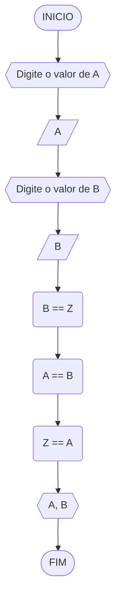

## Pseudocódigo
```
Algoritmo TVL
DECLARE A, B, Z:float
INICIO_ALGORÍTMO
ESCREVA "Digite o valor de A"
LEIA A
ESCREVA "Digite o valor de B"
LEIA B
Z == B
B == A
A == Z

ESCREVA"A, B"
FIM_DO_ALGORITMO
```
## TESTE DE MESA

| Passos | A | B | nome_coluna4 | nome_coluna5 | 
|      --      |      --      |      --      |      --      |      --      | 
| Adicione     | espaço       | se quiser    |  alinhar     | as barras    |   
| verticais,   | mas          | não é        | obrigatório. | Entendido ?  |


